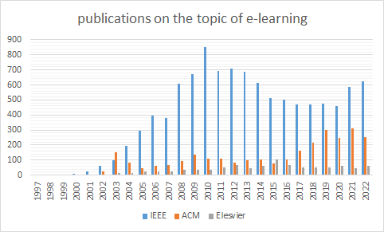
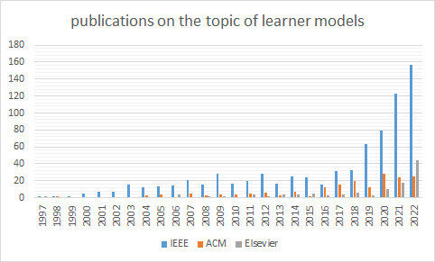

# Results

Looking back over the last 25 years on the topic of e-learning and adaptive learning systems using Learner Models, one immediately notices an unequal distribution of publications on these two closely related topics. The reason for these differences should be explored. For this purpose, three major publishers of scientific works in computer science were used as data sources during the period of the last 25 years - 01/01/1997 to 12/31/2022.

## Methodology
In order to get an overview, we will take a closer look at the topics of e-learning in general and, in comparison, adaptive learning systems using learner models. For this purpose, we define the following search strategy.

### Period
The last 25 years are to be searched. The search results should be aggregated annually. This results in a time dimension between 01/01/1997 to 12/31/2022 with a total of 25 codomains.

### Resources to be searched
The largest publishers in the field of software engineering are to be used as data sources. In this way we hope to obtain as comprehensive an overview as possible. These sources include:
• IEEE Xplore
• ACM Digital Library
• Springer (SpringerLink, Springer Nature)
• Elsevier (ScienceDirect)

Google Scholar, Semantic Scholar, ResearchGate and CiteSeerX were deliberately omitted as possible sources, because on the one hand, these are not publishers in their own right and, on the other hand, build their data in a researcher-centred way. Quality standards were also important to us, which is why we only use sources that have published peer-reviewed papers. For this reason, we did not include providers such as arXiv.org or zenodo.org in our research.

### Search terms
We use a list of synonyms, abbreviations and alternative spellings of the search terms for the search in order to obtain as comprehensive a full picture of the domain as possible. These are connected in a meaningful way with boolean operators. The syntax of the resulting query language must be minimally adapted according to the data source, while the semantics remain unchanged because the data source often have slight differences in the use of search parameters.
Important: This short literature survey is intended to give an aspect in the topic area and can in no way replace a systematic literature search and therefore does not claim to be complete.

### Data selection criteria & quality assessment
The final result includes all peer-reviewed results (as far as it is possible to trace them) in which the language is English or German. If possible, the search results should be restricted to the disciplines of Computer Science, Education, Engineering.

## Results
In the last quarter century, the major publishers in the field of software engineering have published 32511 (IEEE), 9241 (ACM), 5916 (Elsevier) and 40441 (Springer) articles on the topic of "e-learning" (full-text search), and the trend is increasing. However, these publications contain both of the previously described opposing approaches. In order to obtain a reliable basis, these results must be adjusted for the publications on the topic of MOOCs as far as possible. Unfortunately, such a full-text search is of limited value, as it can only be used to pre-filter the results to a limited extent. In order to filter out “MOOC”-matches, for example, the search is therefore limited to the following areas for further analysis: Title, Keywords, Abstract and Metadata. As there is no generally valid generic term for this selection of filter criteria in librarianship, we refer to this collection of bibliographic information with the acronym TiKAMe, which also reflects the canonical order of the filters. At the time of writing the paper, it was not easily possible to search Springer with these requirements, which is why the works are excluded from further analysis. If we now compare the number of publications between full-text search and TiKAMe – described above, we quickly see differences (see Table 1). The differences can be attributed to the fact that now only publications that deal with the topic and not those in which the search term is mentioned once in a subordinate clause are used.

Table 1: Overview of publications (e-learning) by publisher
|           | IEEE | ACM | Elsevier |
| --------- | ---------- | -------- | ------- |
| Full-Text | 32511      | 9241     | 5916    |
| _TiKAMe_  | 10624      | 2840     | 961     |

If we now want to put the topic of "e-learning" in relation to the topic of adaptation, the MOOCs must be filtered out of the results. Table 2 shows the total unfiltered results in the first data row and the results without the MOOC papers in row two. In order to better validate the magnitude of the results, the term e-learning was searched for in row one and all MOOC-related works in row three and the results were totalled across the publication period.

Table 2: Comparison of publications by publisher
|           | IEEE | ACM | Elsevier |
| --------- | ---------- | -------- | ------- |
| e-learning | 10624      | 2840     | 961    |
| e-learning without moocs  | 10410      | 2840     | 133     |
| moocs  | 1878      | 994     | 940     |

The results show that the MOOC matches cannot be directly deducted from the e-learning matches across the board. Because the hypothesis would have been that the addition of lines two and three results in the first line. If one also looks at the MOOC results before 2011, before the concept of Massive Open Online Courses was coined, the results found can be identified as false friends (e.g. as a MOOC protocol or multi-objective optimal control (MOOC) problem or simply as wrongly indexed, especially in the case of mathematical formulas). Let's take a closer look at the distribution of the newly created baselines aggregated into annual intervals (see Figure 1).

If we compare the publications on the topic of "Learner Models" in the same period, the number is very small: 775 (IEEE), 187 (ACM) and 124 (Elsevier). The trend is very slowly increasing, as in recent years the importance of this topic has been increasingly recognized in relation to adaptive learning offerings (compare Figure 2).

Table 3 shows an overview of the publication type with origin assignment. The last row summarizes all other publication types. It is easy to see that most of the publications in this area result from conferences or journals.

Table 3: Publication type with origin assignment at a glance
|           | IEEE | ACM | Elsevier |
| --------- | ---------- | -------- | ------- |
| Conferences | 84%      | 88%     | 0%    |
| Journals / Magazines  | 15%      | 11%     | 92%     |
| other  | 1%      | 1%     | 8%     |

If we look at the publications of "Learner Models" compared to "e-Learning" (without mooc matches) during this period, they account for only 7% (IEEE), 7% (ACM) and 13% (Elsevier).